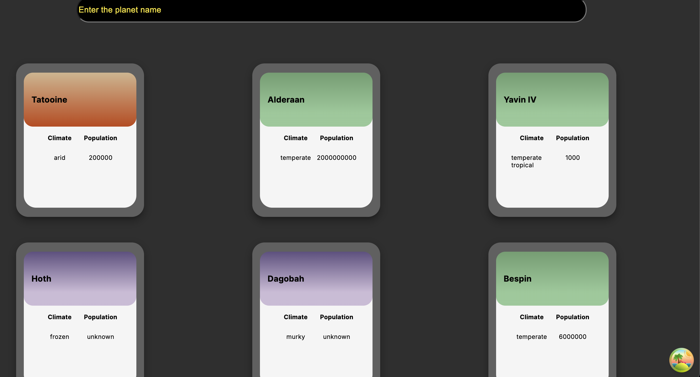

# Planetary Go

Planetary Go is a React application that allows users to search for planets in the Star Wars universe. The application uses React Query for data fetching and caching, and it includes features such as pagination and search by planetName

## Table of Contents

- [Installation](#installation)
- [Usage](#usage)
- [Testing](#testing)

## Installation

To get started with the project, clone the repository and install the dependencies:s

```bash
git clone https://github.com/your-username/planetary-go.git
cd planetary-go
npm install
```

## Usage

```bash
npm run dev
```

## Testing

```bash
npm run test
```

Planet-go should display all planets listed in the [StarWars API](https://swapi.dev/)



To search for a specific planet, go to the search bar and type the name of the planet you want.

To see the planet's details, just hover your mouse over the card and it will flip over and show more details about it.